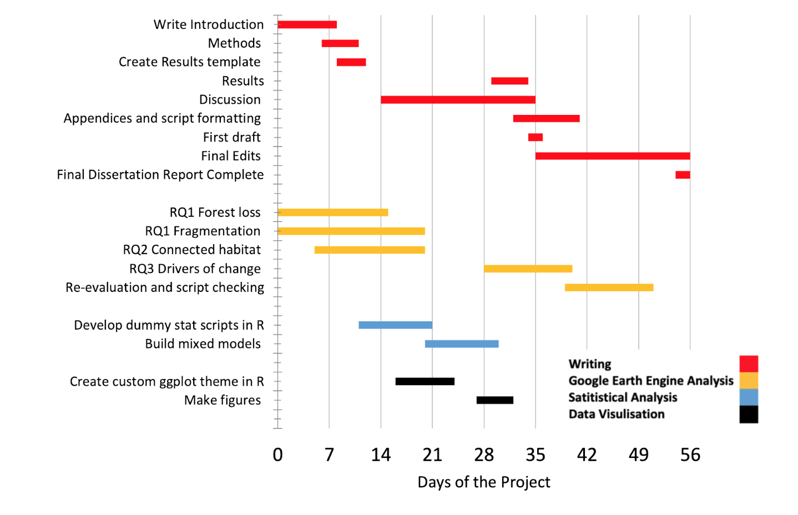

# Red-Panda-Hub

### Welcome!

#### This is my repo for my 4th year dissertation project at the University of Edinburgh. This repo currently functions as a place to store and back up my work. It holds the final dissertaion, code, and materials used. 

Repository structure:

- [Draft dissertaion sections.](./dissertation_transcripts)
- [data.](./data)
- [Google Earth Engine code and files.](./google_earth_engine)
- [R code (models, data manipulation, data visulisation)](./R_scripts)
- [Images](./images)

#### My proposed workflow:

More info on the project will eventually be found on my [website](https://cameroncosgrove.github.io/).

