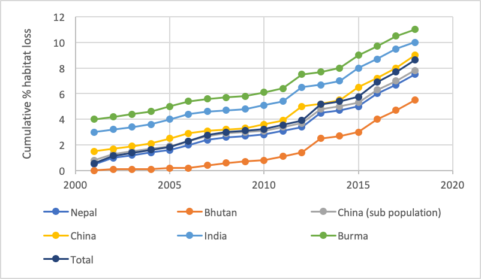
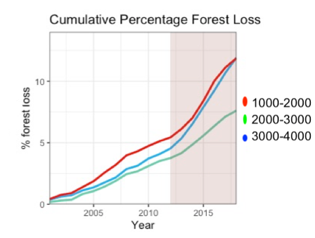
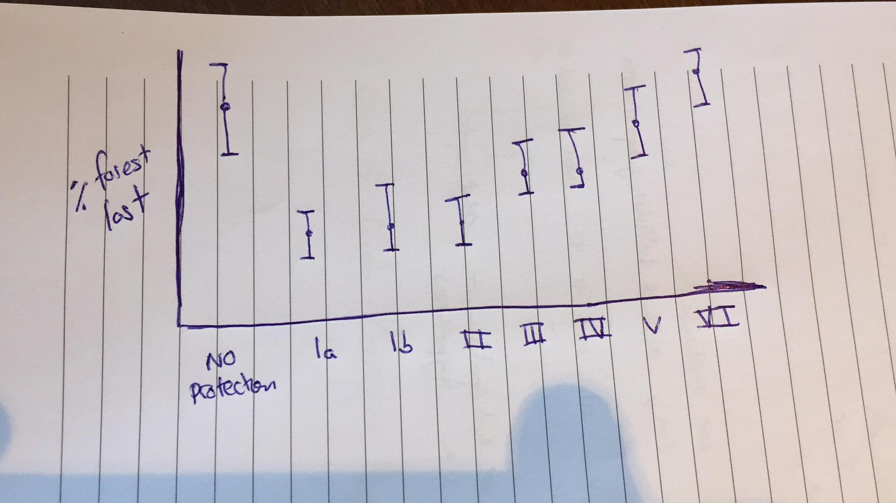
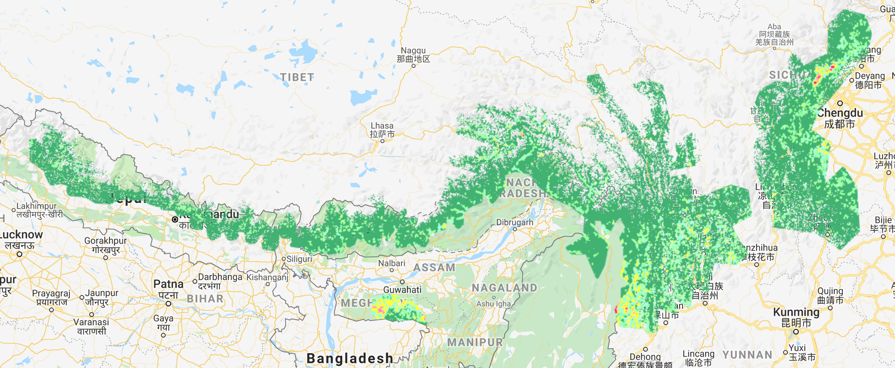

# Evaluating habitat change of the red panda (_Ailurus Fulgens_) from 2000 - 2018 

# Summary 

(rough outline)

Habitat loss has consistently been identified as the largest threat facing the endangered red panda. The species' low dispersal capabilities, arboreal lifestyle, and narrow distribution also make red pandas particularly susceptible to reproductive isolation cause by habitat fragmentation. For the first time, this dissertation quantifies the extent of habitat loss across the red pandas entire range, and maps the areas of low and high habitat disturbance. My results estimate an area of XXX km2 of forest habitat has been lost since 2000 - 2018. The XXX area and the YYY area show the most pronounced forest loss. No countries show a net increase in forest from 2000 - 2012 in red panda habitat. Protected areas sufficiently/insufficiently protect forest. Habitats at lower elevation show the highest amount of habitat loss, which correlates with higher human population. The forest network in red panda habitat is likely fragmented into 3 isolated populations, with X habitat bottlenecks experiencing moderate to high disturbance. The conservation implications of this work are...

# Contents Page
####Summary

####Table of contents

####Acknowledgements

####List of abbreviations

#### 1. Introduction 
- #### 1.1 Red panda ecology
    - #### Two species or one?
- #### 1.2 Threats and current conservation efforts 
    - #### Remote sensing tools
- #### 1.3 Project Rationale 
- #### 1.4 Research questions and hypotheses

#### 2. Methods
* #### 2.1 Defining the study area
* #### 2.2 Data collection 
    * #### Global Forest Change Dataset
    * #### Red Panda MaxEnt distrubution 
* #### 2.3 Data processing
    * #### Forest Change 
    * #### Hot spot identification
* #### 2.4 Data analysis

#### 3. Results
* #### How forest cover has changed in predicted red panda habitat from 2000-2018
* #### Protected areas and habitat loss
* #### Key areas of habitat loss

#### 4. Discussion 
* #### How is Red Panda Habitat changing?
* #### Conservation implications
* #### Limitations 
* #### Future work

# Acknowledgements
I would like to thank.. 

# Abbreviations 
GEE - Google Earth Engine 

# Intro 
### 1.1 Red panda ecology
### 1.2 Threats and current conservation efforts 
### 1.3 Project Rationale 
### 1.4 Research questions and hypotheses

(Forest Loss within the range not Habitat loss)

####RQ1: How is the area of red panda habitat changing?
(switch to present test) Make into hypotheiis and not preidiction 

Sizeable amount preidcted
Large amount predicted for my hypotheis I have chosen 10% loss 
DIRECTION
H1: The area of red panda habitat has decreased by 5% from 2000 to 2018 across its entire range.

H10: There is less than 5% forest loss in the area of red panda habitat from 2000 to 2018.

H2: Low suitability habitat will show 5% more forest loss than moderate and core suitability classes.
-merge-
H2: More habitat will be lost at lower elevations (Should I drop this?)

####RQ2: Is forest loss less in protected areas

H1: The magnitude and rate of red panda forest loss will be less in protected areas with the higher IUCN rating (find protected name exactly).

#### Prediction Paragraph (or intergrated in with above) 
MAGNITUDE 
If I find X result then this will mean, but I find Y then this will mean 

# Methods 
### 2.1 Defining the study area
The distubution of red pandas best described by probability models. Survey data is sparse and located to areas with good access. Red pandas have a narrowly defined niche so MaxEnt modeling works particulairy well.
Red Panda MaxEnt distrubution recreated using polygons and photoshop. Not perfect but sufficent with the data I had access to. 

Protected area polygons and classifications from Protected Planet 

Elevation data from SRTM Digital Elevation Data 30m
### 2.2 Data collection 

How I processed the hansen data. 

Forest gain is only measured up to 2013. I will give an aggregate loss:gain ratio for 2000 - 2013 to indicate level of net change distubance. Not much land abandoment I think in this region. 

Percentage regrowth is also needed to interpreate results. Regrowth would happen for natraul area distubance from 2000 to ~2005. This can be interpretaded as the amound of loss which is natural. This would assume that all human disturbance was permanent. (Is this needed? If forest is lost, no matter if it regrows, it still counts as loss of suitable habitat for red pandas from 2000-2018.)
####Global Forest Change Dataset

### 2.3 Data processing
####Forest Change 
Hansen does not detect a reduction in %treecover unless it is from treecover -> no treecover. For example, a decrease in canopy cover from 90% to 5% would not be detected. Small scale deforestation is underestimated. 

User accuracy is very high for Hansen dataset but it vastly underestiamtes the area of deforestation in areas with selective felling (ed mitchard validation of hansen paper). Comparing relative changes is the most appropriate way of displaying the data. However, to do this I have to assume the type of deforestation (small and selective, with other moderate sized patches of clearfell) is consistet across the entire range. I think it is reasonable to assume this as all sites are mountainous and felling is done for firewood, and small areas of patsure. Forest loss from natural fires should be consitent across the range too. 

Any vegetation >5m is a forest. This is sometimes problematic with tea platations in the region. 

Spatial fedelity with the location of defrestation is preserved even with these caveats. Assuming all panda habitat is changing due to the same pressures, reletive meausres of comparison (i.e %'s) are justified and useful. In summary: Hansen can reliably show where loss is occuring, but underestimates how much loss is occuring, especialy in panda habitat due to the nature of deforestation practices. 

Need to consider forest gain as well. Only data from 2000-2013 aggregated. Gain error is specific to gain. Give ratio to loss 2000-2013. Compare 'remote and intact forest' sample sites to gauge what the natural(neutral/background?) level of loss and gain is. 

Possibility of gain and loss pixels: Only pathway with my methods:
Forest -> loss pixel -> gainpixel ONLY.
I mask my map with >25% treecover so no gain can be from previously unforested land unless it was cut down and regrown within 2000->2013. 
I do not consider regrowth from non-forest land beacuse red pandas require mature forests with a developed understory. This is unlikly to occur between 2000 and 2018 in this slow growing region.

There could be previously clear forest before 2000 that is regenerating. My methods do not detect this. The data is insufficent to isolate plantation regrowth vs natural. However, it is assumed that treecover2000 represents primary forest. Some of the treecover2000 layer will have been planted but due to the remoteness and recent human epansion to the region it is assumed that the vast majority of forest present in 2000 will be primary.  

### 2.4 Data analysis
My data does not have sampling error. The output is an absolute count of a region. To get the error for my measurments I have to use the prestated error in the hansen paper and other papers that have used this dataset. 

It is important we know how reliable Hansen is in specific ecosytems. A paper quanifiyes this for my study area (useful!)
Two aspects to Hansen error.

1 - How accuratly does hansen detect loss? i.e is a loss pixel acutally a loss pixel. Users Accuracy as defined with hansens calssification.

2 - How much forest loss/gain area does hansen actually measure in the real world? It will miss any deforestation that is <30m2 in size. Also the hansen definition of forest will detect some vegetation that would no tbe considered forest, such as large tea plantations on slopes. 

#### How I plan to do my stats
I have forest loss over each year and a total accucmulated loss from 2018.

I can run a simple lm to test if loss is increasing over time.
 - This can be done without adding error terms? The error should be the same for every measurment
 
I can run an ANOVA on the total accucmulated loss to compare loss between regions
 - Anovas compare means between groups and require an error term for each mean. I can add a location specific user accuracy error term to each absolute measurment. This [paper](https://advances.sciencemag.org/content/2/4/e1501675.full) gives location specific error terms for my locations in the supplementary  material. User Accuracy is 89% for loss pixels. 
 
 
For reporting the area of loss, I can give a reasonable estimate of how much forest loss is not detected using figures stated in other papers. 31.7% +/- 28.4% (95% CI) more loss that hansen estimate is reported by the tiger paper (Very similar results to another paper). They compared hansen stated loss with a visual assessment of loss from 2.4m resolution imagery in Tiger habitat that overlaps with Red Panda habitat. So I can bump up my loss estimates by 31.7% and add +/- 28.4%.

## Results
### RQ1: How is the area of red panda habitat changing?
#### Hypothesis 1 : The area of red panda habitat will have decreased by over 5% from 2000 to 2018.

#### H2: Low suitability habitat will show 5% more forest loss than moderate and core suitability classes.

Moderate and Core habitat has lost ~ 12% of habitat from 2000 to 2018.

#### Gain loss ratio table for the above figure for 2000 - 2013:

| Low Suitability| Moderate Suitability  | Core Suitability |
| ------------- |-------------| -----|
| 0.14     | 0.30 | 0.29 |

#### H3: More habitat will be lost at lower elevations

### RQ 2: Do protected areas conserve red panda habitat?

or

####Where are the hotspots and coldspots of habitat loss?

## Discussion 

#### How is Red Panda Habitat changing?
#### Conservation implications
#### Limitations 
#### Future work

