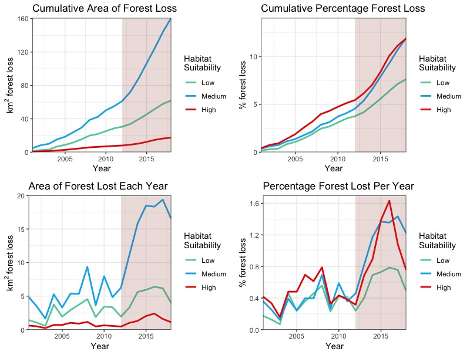
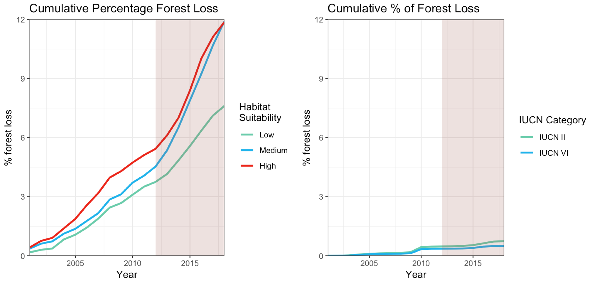
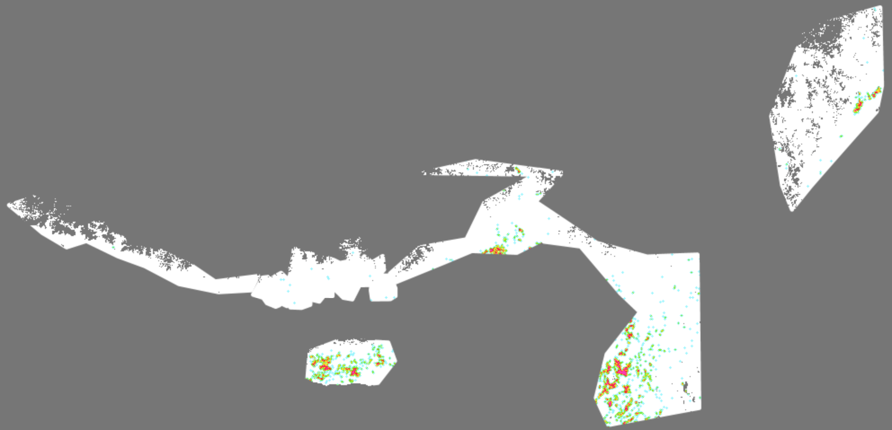
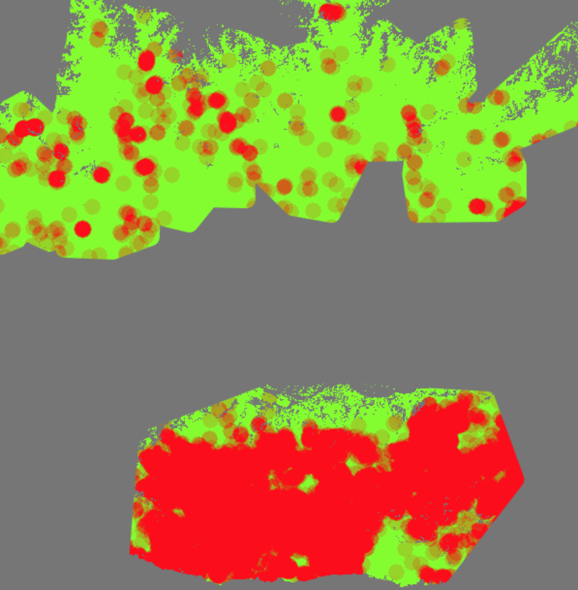

# Quantifying habitat change of the red panda (_Ailurus Fulgens_)

# Summary 
Habitat loss has consistently been identified as the largest threat facing the endangered red panda. The species low dispersal capabilities, arboreal lifestyle, and narrow distribution also make red pandas particularly susceptible to reproductive isolation cause by habitat fragmentation. For the first time, this dissertation quantifies the extent of habitat loss across the red pandas entire range, and identifies possible new isolated sub populations. My results estimate an area of XXX km2 of forest habitat has been lost since 2000 - 2018. The XXX area and the YYY area show the most pronounced forest loss. Rates of forest loss are /increasing/decreasing/country-dependant. No countries show a net increase in forest from 2000 - 2012 in red panda habitat. Protected areas sufficiently/insufficiently protect forest. The forest network in red panda habitat is likely fragmented into X isolated populations, X of which were unknown prior to this study. The conservation implications of this work are...

# Contents Page
Summary
Table of contents
Acknowledgements
List of abbreviations

#### 1. Introduction 
- #### 1.1 Red panda ecology
- #### 1.2 Threats and current conservation efforts 
- #### 1.3 Project Rationale 
- #### 1.4 Research questions and hypotheses

#### 2. Methods
* #### 2.1 Defining the study area
* #### 2.2 Data collection 
    * #### Global Forest Change Dataset
    * #### Red Panda MaxEnt distrubution 
* #### 2.3 Data processing
    * #### Forest Change 
    * #### Hot spot identification
* #### 2.4 Data analysis

#### 3. Results
* #### How forest cover has changed in predicted red panda habitat from 2000-2018
* #### Key areas of habitat loss

#### 4. Discussion 
* #### How is Red Panda Habitat changing?
* #### Conservation implications
* #### Limitations 
* #### Future work

# Acknowledgements
I would like to thank.. 

# Abbreviations 
GGE - Google Earth Engine 

# Intro 
### 1.1 Red panda ecology
### 1.2 Threats and current conservation efforts 
### 1.3 Project Rationale 
### 1.4 Research questions and hypotheses
####RQ1: How is the area of red panda habitat changing?

H1: The area of red panda habitat will have decreased by over 5% from 2000 to 2018 across its entire range.

H10: There is less than 5% forest loss in the area of red panda habitat from 2000 to 2018.

####RQ2: Do protected areas conserve red panda habitat? 

H1: The magnitude and rate of red panda habitat loss will be less in protected areas with the higer IUCN rating correlating with lower forest loss. 

#### RQ 3: Where are the hotspots of habitat loss?

H1: Hotspots of habitat loss (defined as >30% forest loss in a circle with r=2.5km) will be focused towards the southern and less mountainous parts of the red panda range. (Below 2000m??)

Red pandas are separated into more than three sub populations separated by a gap in forest cover of >30km between each population.

H10: Red pandas are isolated into three sub populations (the three previously known).

# Methods 
### 2.1 Defining the study area
The distubution of red pandas... 
Red Panda MaxEnt distrubution 
Can easily recreate my own Feature collection using polygons and the MaxEnt map. I have done most of this. 
### 2.2 Data collection 
Justification of methods 
- What can be resonably inferred about actual on the ground change using the GEE and pre processed data products?
Explict methods 
- Forest cover calculation
A reletive measure is needed to easily compare areas. Aggregate loss every year relative to 2000 forest cover. 

Forest gain is only measured up to 2013. Give an aggregate loss:gain ratio for 2000 - 2013 to indicate level of net change distubance. Not much land abandoment I think in this region. 

Percentage regrowth is also needed to interpreate results. Regrowth would happen for natraul area distubance from 2000 to ~2005. This can be interpretaded as the amound of loss which is natural. This would assume that all human disturbance was permanent. (Is this needed? If forest is lost, no matter if it regrows, it still counts as loss of suitable habitat for red pandas from 2000-2018.)
####Global Forest Change Dataset

### 2.3 Data processing
####Forest Change 
####Sub population
### 2.4 Data analysis

### Google Earth Engine 

### Data Analysis 

## Results
### RQ1: How is the area of red panda habitat changing?
#### Hypothesis 1 : The area of red panda habitat will have decreased by over 5% from 2000 to 2018.

Moderate and Core habitat has lost ~ 12% of habitat from 2000 to 2018.

#### Gain loss ratio table for the above figure for 2000 - 2013:

| Low Suitablility| Moderate Suitability  | Core Suitability |
| ------------- |-------------| -----|
| 0.14     | 0.30 | 0.29 |

### RQ 2: Do protected areas conserve red panda habitat?

#### Hypothesis 1
<image of example figure>

### RQ 3: Where is habitat changing
#Where are the hotspots of habitat loss?

#Where is the least disturbed habitat? 

even low levels of loss can impact pandas due to fragmentation and disturbance.
Low disturbance map too? It could be inferred as less fragmented habitat?

I can use a colour ramp to merge both of these figures. Showing in one colour the least distrubed areas, then using a normal heatmap for the rest of the areas
## Discussion 

#### How is Red Panda Habitat changing?
#### Conservation implications
#### Limitations 
#### Future work

